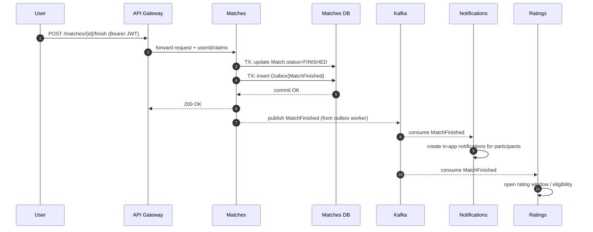
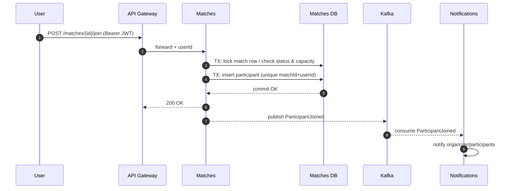

```mermaid
sequenceDiagram
  autonumber
  participant U as User
  participant GW as API Gateway
  participant M as Matches
  participant DB as Matches DB
  participant K as Kafka
  participant N as Notifications
  participant R as Ratings

  U->>GW: POST /matches/{id}/finish (Bearer JWT)
  GW->>M: forward request + userId/claims
  M->>DB: TX: update Match.status=FINISHED
  M->>DB: TX: insert Outbox(MatchFinished)
  DB-->>M: commit OK
  M-->>GW: 200 OK

  M-->>K: publish MatchFinished (from outbox worker)
  K-->>N: consume MatchFinished
  N->>N: create in-app notifications for participants

  K-->>R: consume MatchFinished
  R->>R: open rating window / eligibility
```

```mermaid
sequenceDiagram
  autonumber
  participant U as User
  participant GW as API Gateway
  participant M as Matches
  participant DB as Matches DB
  participant K as Kafka
  participant N as Notifications

  U->>GW: POST /matches/{id}/join (Bearer JWT)
  GW->>M: forward + userId
  M->>DB: TX: lock match row / check status & capacity
  M->>DB: TX: insert participant (unique matchId+userId)
  DB-->>M: commit OK
  M-->>GW: 200 OK

  M-->>K: publish ParticipantJoined
  K-->>N: consume ParticipantJoined
  N->>N: notify organizer/participants
```